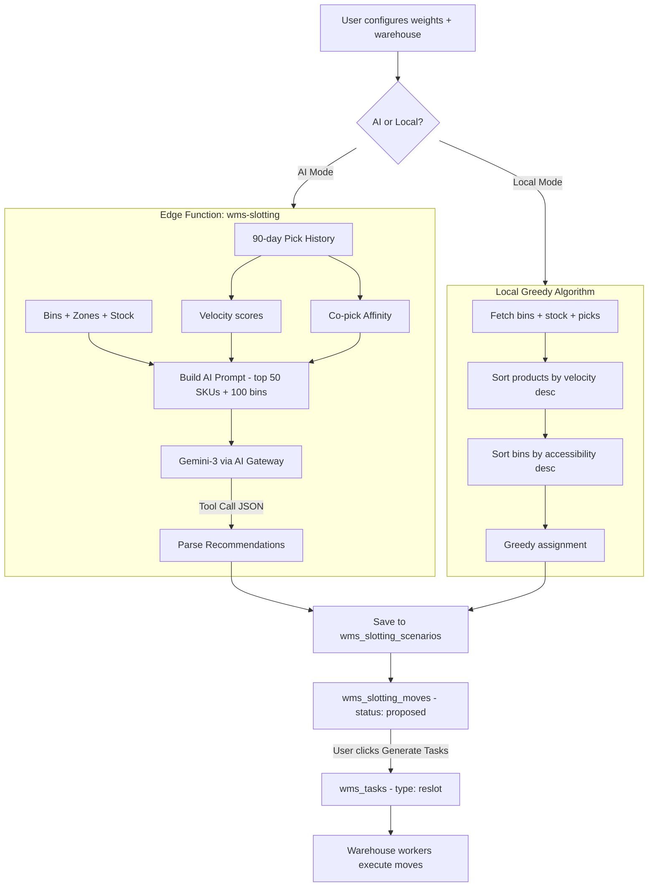

# WMS AI (Warehouse Management with AI)

## Current State

The WMS module provides a comprehensive warehouse management system with standard operational features and an AI-driven slotting optimization engine.

### AI Slotting Optimization (`WmsSlotting.tsx` + `wms-slotting` Edge Function)

#### Scenario Management System
Named scenarios are persisted in the `wms_slotting_scenarios` table with full status tracking (`analyzing` → `completed`). Users browse past scenarios in a sidebar panel, select any to review its KPIs (travel reduction %, proposed moves count, status badge), and inspect the detailed move plan.

#### Dual-Mode Analysis (AI + Local Heuristic)
The analysis dialog includes a **Switch toggle** between two modes:

- **AI Mode**: Calls the `wms-slotting` edge function, which:
  1. Fetches 90-day completed pick history from `wms_tasks`
  2. Computes per-SKU velocity scores (picks/week)
  3. Computes co-pick affinity matrix (how often two SKUs appear in picks from the same bin)
  4. Retrieves bin data with zone info, accessibility scores, and current stock
  5. Constructs a prompt with the top 50 SKUs by velocity, top 100 bins by accessibility, and user-specified optimization weights
  6. Sends to **Gemini-3** via the Lovable AI gateway using tool-calling schema (`submit_slotting_plan`)
  7. Parses the structured JSON response containing SKU→bin recommendations and estimated travel reduction

- **Local Mode**: Built-in greedy heuristic that:
  1. Fetches all bin stock, bins, and 90-day pick history in parallel
  2. Computes velocity per product from pick history
  3. Sorts products by descending velocity, bins by descending accessibility score
  4. Greedily assigns highest-velocity products to highest-accessibility bins
  5. Calculates improvement as the percentage gain in total accessibility score
  6. No external API call required

#### User-Adjustable Optimization Weights
Three linked sliders control the optimization priorities:
- **Travel Reduction** (default 70%)
- **Affinity Grouping** (default 20%)
- **Space Utilization** (default 10%)

Sliders auto-balance to always sum to 100%. Weights are passed to both AI and local algorithms as fractional values.

#### Move Plan with Lifecycle
Recommendations from either mode are saved to `wms_slotting_moves` with statuses:
- `proposed` → initial AI/local output
- `approved` → user clicked "Generate Tasks"
- `executed` → warehouse worker completed the reslot task

Each move tracks: `product_id`, `from_bin_id`, `to_bin_id`, `priority`, `quantity`, and linked `task_id`.

#### Task Generation
The **"Generate Tasks"** button converts all `proposed` moves into actionable `wms_tasks` records with:
- `task_type: "reslot"`
- `status: "pending"`
- Priority carried from the move's priority ordering
- `from_bin_id` and `to_bin_id` for worker instructions
- Move status updated to `approved` with the linked `task_id`

### Full WMS Module Beyond AI

| Feature | Page | Key Capabilities |
|---------|------|-------------------|
| **Dashboard** | `WmsDashboard.tsx` | KPI cards (total bins, utilization %, pending/in-progress/completed tasks), task status pie chart, tasks-by-type bar chart, zone overview grid, recent activity feed, quick action buttons |
| **Tasks** | `WmsTasks.tsx` | Full lifecycle (pending → assigned → in_progress → completed/exception), manual task creation, batch operations (start/assign/cancel), worker assignment, priority management (1–5 with inline select), performance KPIs (avg completion time) |
| **Receiving** | `WmsReceiving.tsx` | PO linkage, lot/serial tracking, bin assignment |
| **Picking** | `WmsPicking.tsx` | Wave management |
| **Cycle Counts** | `WmsCycleCounts.tsx` | Variance approval workflow |
| **Zones** | `WmsZones.tsx` | Zone management with warehouse association |
| **Bin Detail** | `WmsBinDetail.tsx` | Individual bin inspection, stock contents, movement history |
| **Slotting** | `WmsSlotting.tsx` | AI/local optimization engine (described above) |

---

## Issues / Risks

### Data Volume
Full pick history, bin stock, and bin arrays are fetched from the database before slicing for the AI prompt. The edge function now limits with SQL filtering (accessibility > 0, top 100 bins, 5000 pick history limit), but unsliced arrays may still be large for very big warehouses.

### ~~AI Constraint Validation~~ ✅ RESOLVED
~~No post-AI capacity checking exists.~~ **Fixed:** Both AI and local modes now validate bin capacity (`max_units` vs current occupancy) before saving moves. The edge function performs server-side capacity checks, and the local heuristic skips bins at capacity.

### Error Handling
On AI error, a toast notification displays the error message. When recommendations are empty, the move plan table shows a `"noResults"` message. The edge function catches JSON parsing errors and returns empty results. However, partial failures (e.g., some moves valid, some not) are not distinguished.

### Security
The `wms-slotting` edge function validates JWT authentication and checks tenant membership via `createClient` with the user's auth header. CORS headers are set to `*`, which is acceptable since Supabase Edge Functions require valid auth headers regardless.

### ~~Sequential Task Generation~~ ✅ RESOLVED
~~`generateTasksMutation` issues one `INSERT` per move sequentially in a `for` loop.~~ **Fixed:** Task generation now uses a single bulk `INSERT` for all reslot tasks, eliminating N+1 database round-trips.

### ~~No Scenario Comparison~~ ✅ RESOLVED
~~Users cannot compare two scenarios side-by-side.~~ **Fixed:** A scenario comparison view now allows selecting two completed scenarios and viewing KPI diffs (travel reduction %, move count) in a side-by-side layout.

### ~~Local Algorithm Ignores Capacity~~ ✅ RESOLVED
~~The local greedy algorithm sorts bins by `accessibility_score` but does not check `max_units`.~~ **Fixed:** The local heuristic now validates bin capacity before assignment, skipping bins that are already at capacity.

---

## Recommendations

### ✅ Implemented

- **Batch INSERT for task generation**: Single bulk insert replaces sequential loop.
- **Bin capacity validation**: Both AI and local modes validate capacity before saving moves.
- **SQL-filtered data fetching**: Edge function uses `accessibility > 0`, top 100 bins, 5000 pick history limit.
- **Scenario comparison view**: Side-by-side KPI diff for comparing optimization runs.

### Short-term

- **Restrict prompt data further**: Filter bins to only those with available capacity (`max_units > current_stock`) before loading.
- **Purchasing narrative integration**: The new `purchasing` context type in `ai-analytics-narrative` covers supplier dependency analysis, which can inform WMS slotting decisions (e.g., prioritizing bins for products from at-risk suppliers).

### Medium-term

- **Cross-validation (Hybrid)**: Add a "Compare" mode that runs both AI and local algorithms, then presents results side-by-side.

- **`wms_product_stats` precomputation table**: Store rolling velocity (picks/week), last pick date, and average daily movement per product. Update via a scheduled function or trigger.

- **Affinity graph persistence**: Maintain a `wms_affinity_pairs` table updated daily with co-pick counts between product pairs.

- **Background/scheduled slotting**: For large warehouses, make slotting analysis a scheduled or on-demand background job.

### Long-term

- **Specialized ML model**: Replace the general LLM with a reinforcement learning or combinatorial optimization model trained on historical warehouse data for more reliable, constraint-aware recommendations.

- **Simulation integration**: Integrate with a warehouse simulation engine to predict actual travel time improvements using warehouse layout geometry and pick itineraries, rather than relying on accessibility score proxies.

---

## Data / Schema

### Already Implemented
- `wms_slotting_scenarios`: Stores named scenarios with parameters (weights), status, results (JSON), and `estimated_improvement` (JSON with `travel_reduction_pct`, `moves_count`, `summary`)
- `wms_slotting_moves`: Individual move recommendations with product, from/to bin, priority, status lifecycle, and linked task_id
- `wms_bins`: Includes `accessibility_score`, `max_units`, `sort_order`, `level`, `zone_id`
- `wms_bin_stock`: Current stock levels per bin per product
- `wms_tasks`: Operational tasks including `reslot` type generated from slotting

### Recommended Additions
- **`wms_product_stats`**: Precomputed velocity, last pick date, avg daily movement — avoids recalculating from raw history each time
- **`wms_affinity_pairs`**: Persisted co-pick counts between product pairs, updated daily
- **Typed `estimated_improvement`**: Consider adding dedicated columns (`travel_reduction_pct NUMERIC`, `moves_count INTEGER`) to `wms_slotting_scenarios` instead of relying on JSON

---

## Testing

| Test | Type | Description |
|------|------|-------------|
| Velocity calculation | Unit | Given known pick history, verify velocity scores are correct |
| Co-pick affinity | Unit | Given known pick history with co-located picks, verify affinity matrix |
| Local algorithm | Unit | Given known bins + stock + picks, verify greedy assignment produces valid recommendations |
| Scenario persistence | Integration | Create scenario → verify it appears in scenarios list with correct status and parameters |
| Move plan persistence | Integration | Run analysis → verify moves saved to `wms_slotting_moves` with correct product/bin/priority |
| Generate Tasks | Integration | Click Generate Tasks → verify `wms_tasks` records created with type `reslot` and correct bin assignments |
| AI gateway mock | Integration | Mock `fetch` to AI gateway → return fixed JSON → verify edge function parses and returns it |
| Empty pick history | Edge case | Run analysis with no pick history → verify no error, empty recommendations shown |
| Large data performance | Performance | With 1000+ bins and products, measure edge function response time stays under 30s |

---

## Monitoring

- **Function Metrics**: Monitor `wms-slotting` edge function CPU time, memory usage, and invocation count via Supabase dashboard
- **User Tracking**: Log how often recommendations are viewed, how many are converted to tasks, and task completion rates
- **AI Quality**: Track `estimated_improvement.travel_reduction_pct` over time to assess whether AI recommendations are improving

---

## Comparison: AI vs Traditional Slotting Approaches

| Approach | Status | Pros | Cons |
|----------|--------|------|------|
| **AI-based (Gemini-3)** | ✅ Implemented | Learns from holistic patterns (velocity + affinity). Provides natural-language summaries. Handles complex multi-factor optimization. | Opaque reasoning, may hallucinate, depends on prompt quality. Cannot enforce hard constraints (capacity). API cost per invocation. |
| **Local Greedy (current)** | ✅ Implemented | Fast execution, no API cost, deterministic results. Simple velocity × accessibility assignment. | Ignores affinity grouping. Doesn't check bin capacity. May get trapped in local optima. |
| **Metaheuristics (GA, SA)** | ❌ Not implemented | Can handle constraints and multi-objective optimization via penalty functions. Deterministic after tuning. | Complex to implement and tune. Slower than greedy. |
| **ML (non-LLM)** | ❌ Not implemented | Reinforcement learning could learn strategies from simulation. Domain-specific. | Requires large training data and simulation environment. |
| **Hybrid (AI + Heuristic)** | 🔶 Partially (dual toggle) | Dual-mode toggle exists. Could cross-validate by running both and comparing. Best of both worlds. | No automatic cross-validation yet. User must manually compare. |

---

## Flow Diagram (WMS Slotting Process)

